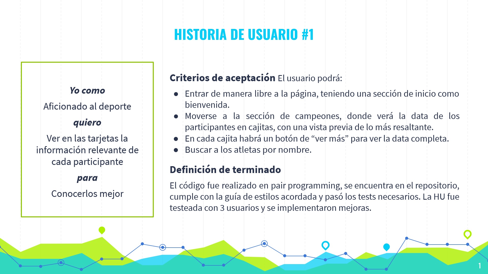
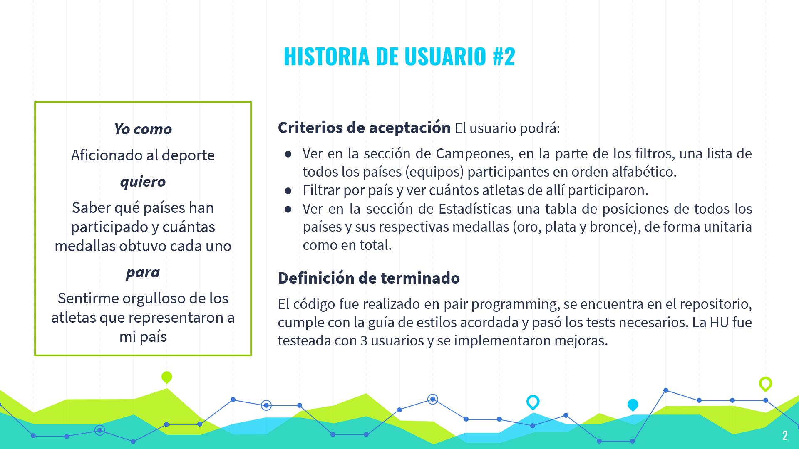
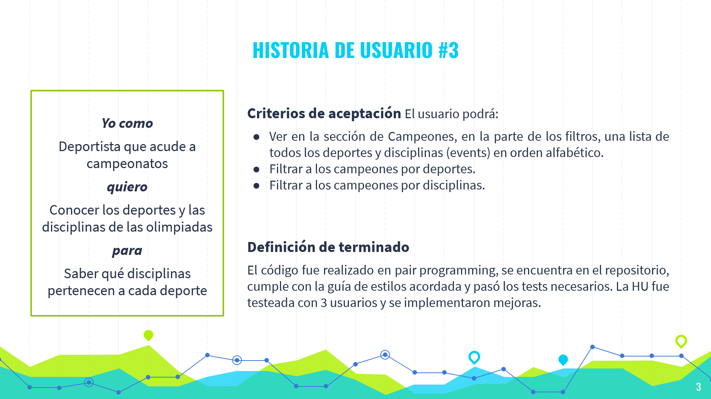
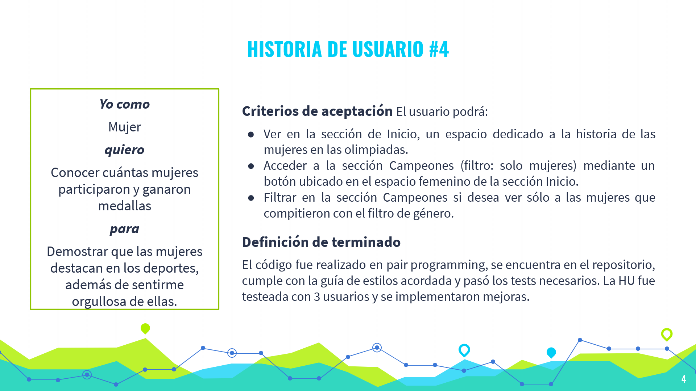
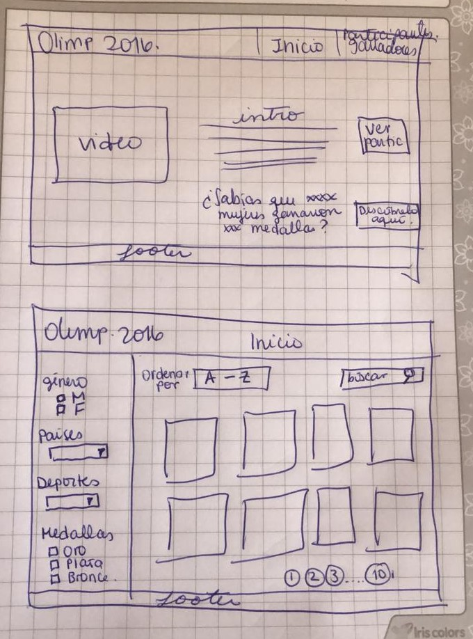

# DATA LOVERS

## Índice

* [1. Definición del producto](#1-definición-del-producto)
* [2. Historias de usuario](#2-historias-de-usuario)
* [3. Diseño de la Interfaz de Usuario](#3-diseño-de-la-interfaz-de-usuario)
* [4. Objetivos aprendidos](#4-objetivos-aprendidos)

***

## 1. Definición del producto

Presentamos una página web que tiene como temática las Olimpiadas Rio 2016, mostrando a todos los atletas campeones con datos como sus países y deportes en los que compitieron. El principal objetivo de la página es poder filtrar, ordenar y calcular la data mediante diferentes parámetros (filtrar por nombre, género, países, deporte y evento, ordenar los nombres en forma ascendente o descendente, calcular la cantidad de medallas por país).

### Usuarios del producto
Los usuarios principales son espectadores aficionados al deporte y deportistas que acuden a diversos campeonatos, tanto locales como regionales.

### Objetivos de usuarios en relación al producto
Los espectadores buscan conocer más acerca de los atletas que compitieron en las diferentes disciplinas, y los deportistas buscan estudiar a profundidad las características de los participantes de juegos anteriores para tratar de llegar al nivel de la disciplina que practican.

### Proceso de diseño en base a los objetivos de los usuarios
Según los hallazgos, diseñamos una propuesta interesante para ambos tipos de usuarios, los espectadore y deportistas, con los datos más relevantes de los deportistas a primera vista, pero con los datos más específicos en cada tarjeta de los atletas. Además, en la página de inicio incluímos una sección dedicada especialmente a las mujeres, quienes a través de los años han obtenido una presencia más significativa en las olimpiadas.

## 2. Historias de usuario

Nos basamos en 5 historias de usuario, según los hallazgos: 
* 2 de los aficionados al deporte

* 1 de los deportistas

* 1 de las mujeres 

## 3. Diseño de la Interfaz de Usuario

### Prototipo de baja fidelidad

Para hacernos una idea de cómo sería nuestra página, realizamos un bosquejo sencillo que mostraba las dos primeras páginas:

### Prototipo de alta fidelidad

Decidimos utilizar "Figma" para elaborar nuestro prototipo, obteniendo el siguiente resultado: https://www.figma.com/proto/PjWQD6bi6eT3JXQuZtSbNG/DATA-LOVERS-V2?node-id=1%3A3&scaling=min-zoom

### Testeos de usabilidad

Probamos nuestro prototipo con un total de 6 personas, obteniendo como retroalimentación ciertas mejoras que implementamos en el producto final, como la paleta de colores en base al banner de Río 2016. De hecho, en estos prototipos no incluímos la tercera sección "Estadísticas", solo lo añadimos a medida que fuimos avanzando la página.

## 4. Objetivos aprendidos

### HTML y CSS

* Uso de HTML semántico.
* Uso de selectores de CSS.
* Construir tu aplicación respetando el diseño realizado (maquetación).
* Uso de flexbox en CSS.

### DOM y Web APIs

* Uso de selectores del DOM.
* Manejo de eventos del DOM.
* Manipulación dinámica del DOM (appendChild |createElement | createTextNode| innerHTML | textContent | etc.).

### JavaScript

* Uso de condicionales (if-else | operador ternario)
* Uso de bucles (for)
* Uso de funciones (parámetros | argumentos | valor de retorno)
* Manipular arrays (filter | map | sort)
* Manipular objects (key | value)
* Uso ES modules (`import` | `export`)
* Diferenciar entre expression y statements.
* Diferenciar entre tipos de datos atómicos y estructurados.

### Testing

* Testeo unitario.

### Estructura del código y guía de estilo

* Organizar y dividir el código en módulos (Modularización)
* Uso de identificadores descriptivos (Nomenclatura | Semántica)
* Uso de linter (ESLINT)

### Git y GitHub

* Uso de comandos de git (add | commit | pull | status | push)
* Manejo de repositorios de GitHub (clone | fork | gh-pages)
* Colaboración en Github (branches | pull requests)

### UX

* Diseñar la aplicación pensando y entendiendo al usuario.
* Crear prototipos para obtener feedback e iterar.
* Aplicar los principios de diseño visual (contraste, alineación, jerarquía)
* Planear y ejecutar tests de usabilidad.
